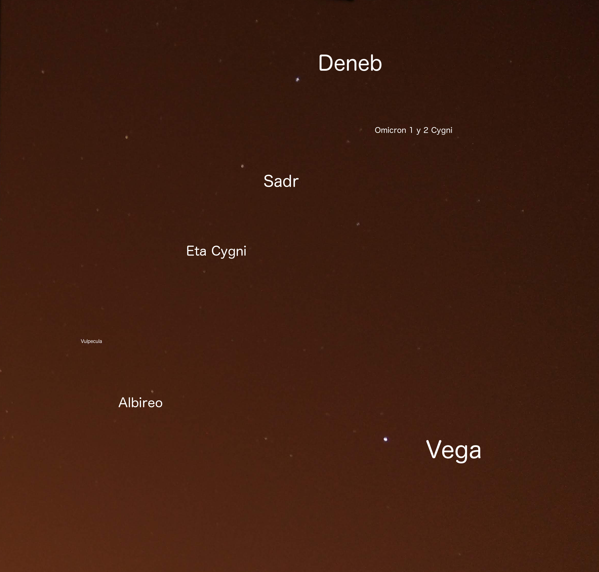

# Observaciones septiembre 2020

## 13 de septiembre, 1 a 2 de la madrugada

Noche con buena visibilidad.

Se distinguen a simple vista las siguientes constelaciones:
- Bootes
- Cygnus
- Lyra
- Perseus
- Cassiopea

Con telescopio
- Marte
- Pléyades

