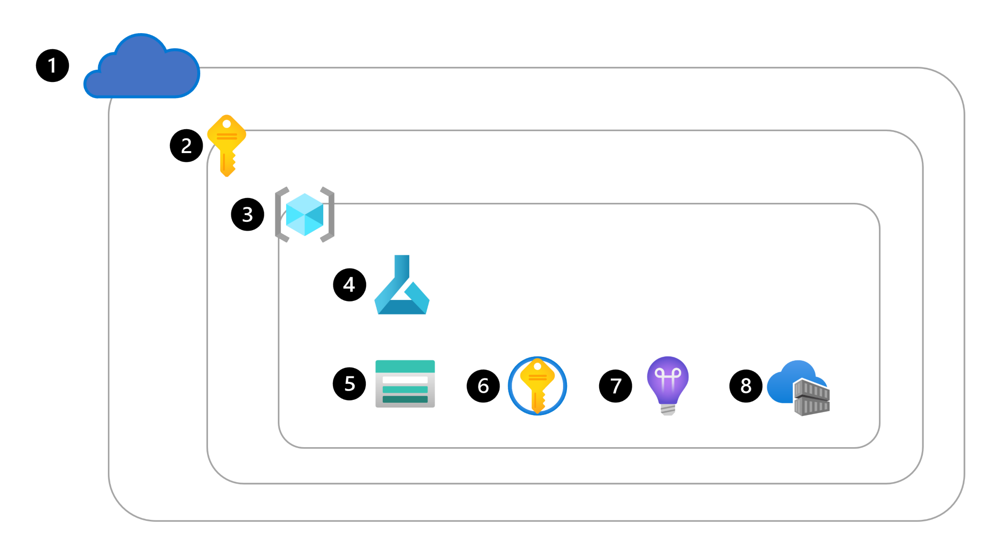
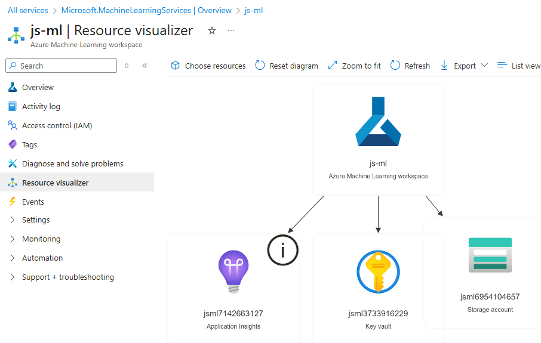
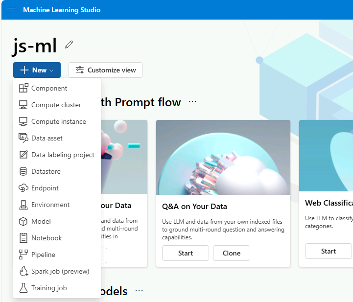
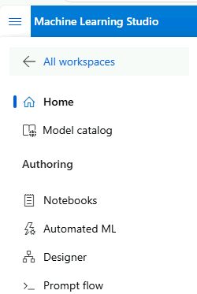
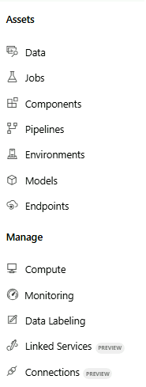
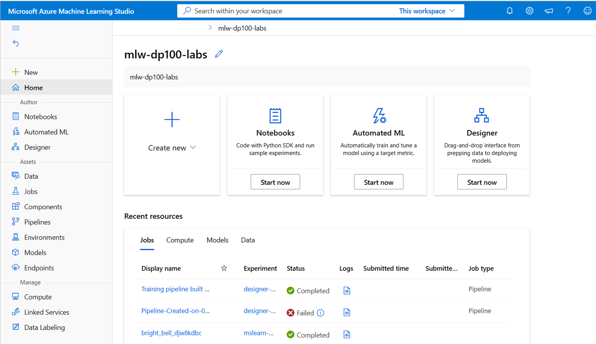

# Azure ML studio

## Overview



Based on the standard architecture of Azure ML Studio, here is the breakdown of the numbered components, representing the key resources of the ecosystem:

1. Microsoft Azure (Cloud): This represents the global Azure cloud environment where all infrastructure resides.
2. Subscription / Resource Group: The first level of organization used to manage billing and access to services.
3. Workspace: centralized Azure ML resource used to manage all assets, such as models, experiments, and compute.
4. Azure ML Service: The main engine that orchestrates the entire machine learning lifecycle.
5. Storage (Azure Storage Account): The default data store for the workspace, where datasets and scripts are saved.
6. Azure Key Vault: Securely stores secrets and sensitive information, such as database keys or tokens.
7. Application Insights: Used for monitoring and logging performance metrics of your deployed models.
8. Azure Container Registry (ACR): Registers and manages the Docker images used for training and model deployment.

**Interface**



**New**




**Authoring/Assets/Manage** 





## Roles

- **Owner**: Gets full access to all resources, and can grant access to others using access control.
- **Contributor**: Gets full access to all resources, but can't grant access to others.
- **Reader**: Can only view the resource, but isn't allowed to make any changes.

Additionally, Azure ML has specific built-in roles you can use:

- **AzureML Data Scientist**: Can perform all actions within the workspace, except for creating or deleting compute resources, or editing the workspace settings.
- **AzureML Compute Operator**: Is allowed to create, change, and manage access the compute resources within a workspace.

## Processes

### Creation

Four alternatives:

- Use the user interface in the **Azure portal** to create an Azure ML service.
- Create an **Azure Resource Manager** (**ARM**) template. [Learn how to use an ARM template to create a workspace](https://learn.microsoft.com/en-us/azure/machine-learning/how-to-create-workspace-template?tabs=azcli%3Fazure-portal%3Dtrue).
- Use the **Azure Command Line Interface** (**CLI**) with the Azure ML CLI extension. [Learn how to create the workspace with the CLI v2](https://learn.microsoft.com/en-us/training/modules/create-azure-machine-learning-resources-cli-v2/).
- Use the **Azure ML Python SDK**.
    - Código
        
        ```python
        from azure.ai.ml.entities import Workspace
        workspace_name = "mlw-example"
        
        ws_basic = Workspace(
        name=workspace_name,
        location="eastus",
        display_name="Basic workspace-example",
        description="This example shows how to create a basic workspace",
        )
        ml_client.workspaces.begin_create(ws_basic)
        ```
        

### User Interface



- **Author**: Create new jobs to train and track a machine learning model.
- **Assets**: Create and review assets you use when training models.
- **Manage**: Create and manage resources you need to train models.

### Python SDK

[Azure SDK Python](https://learn.microsoft.com/en-us/python/api/overview/azure/ai-ml-readme?view=azure-python)
[API Reference](https://learn.microsoft.com/en-us/python/api/azure-ai-ml/azure.ai.ml?view=azure-python)

```python
pip install azure-ai-ml

from azure.ai.ml import MLClient
from azure.identity import DefaultAzureCredential

ml_client = MLClient(
    DefaultAzureCredential(), subscription_id, resource_group, workspace
)
```

### CLI

Install with package manager

**Add extension**

```python
az extension add -n ml -y
```

**Operate (eg create compute target)**

```powershell
az ml compute create --name aml-cluster --size STANDARD_DS3_v2 --min-instances 0 --max-instances 5 --type AmlCompute --resource-group my-resource-group --workspace-name my-workspace
```

## Compute

These are the types of compute:

- **Compute instances**: virtual machine in the cloud, managed by the workspace. Ideal to run (Jupyter) notebooks.
- **Compute clusters**: On-demand clusters of CPU or GPU compute nodes in the cloud, managed by the workspace. Ideal for production workloads as they  scale.
- **Kubernetes clusters**: Allows you to create or attach an Azure Kubernetes Service (AKS) cluster. Ideal to deploy trained machine learning models in production scenarios.
- **Attached computes**: Allows you to attach other Azure compute resources to the workspace, like Azure Databricks or Synapse Spark pools.
- **Serverless compute**: A fully managed, on-demand compute you can use for training jobs.

## Datastores

A datastore is an abstraction layer that simplies access to data.

It is not a store of data but a way to connect to Azure Storage.

When a workspace is created, an Azure Storage account is created and automatically connected to the workspace. As a result, you have four datastores already added to your workspace:


| Datastore Name | Data Storage Type | Data Storage Name | Description |
| :--- | :--- | :--- | :--- |
| **workspaceblobstore** | Blob container | azureml-blobstore-{workspace-id} | Stores data uploads, job code snapshots, and pipeline data cache. Connects to the Blob Storage of the Azure Storage account created with the workspace. Specifically the `azureml-blobstore-...` container. Set as the default datastore, which means that whenever you create a data asset and upload data, you store the data in this container.|
| **workspaceworkingdirectory** | File share | code-{GUID} | Connects to the file share of the Azure Storage account created with the workspace used by the **Notebooks** section of the studio. Whenever you upload files or folders to access from a compute instance, the files or folders are uploaded to this file share. Only in interactive development. |
| **workspacefilestore** | File share | azureml-filestore-{workspace-id} | Alternative container for data upload. |
| **workspaceartifactstore** | Blob container | azureml | Storage for assets such as metrics, models, and components, experiment logs.|

Data to be trained is in the workspaceblobstorage. 

Trained models and metrics are in the workspaceartifactstorage.

[MS Learn](https://learn.microsoft.com/en-us/azure/machine-learning/concept-data?view=azureml-api-2&tabs=uri-file-example%2Ccli-data-create-example#datastore)

[Use datastores](https://learn.microsoft.com/en-us/azure/machine-learning/how-to-datastore?view=azureml-api-2&tabs=cli-identity-based-access%2Csdk-adls-identity-access%2Csdk-azfiles-accountkey%2Csdk-adlsgen1-identity-access%2Csdk-onelake-identity-access)