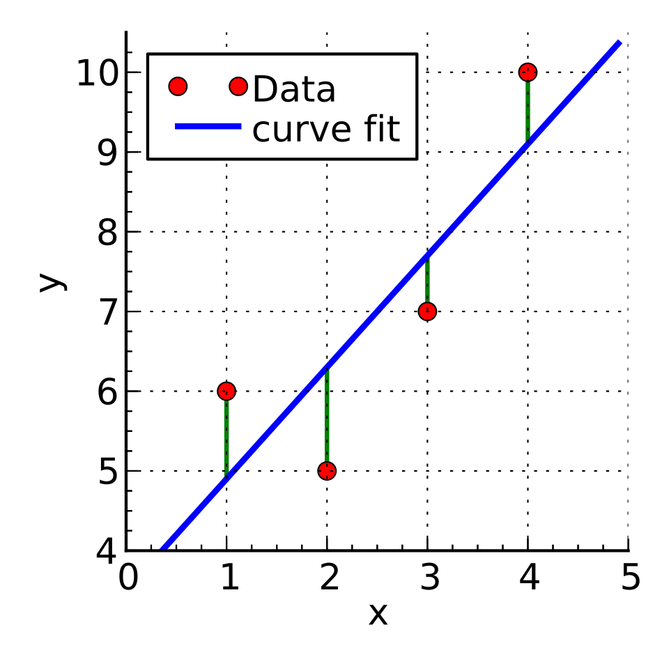
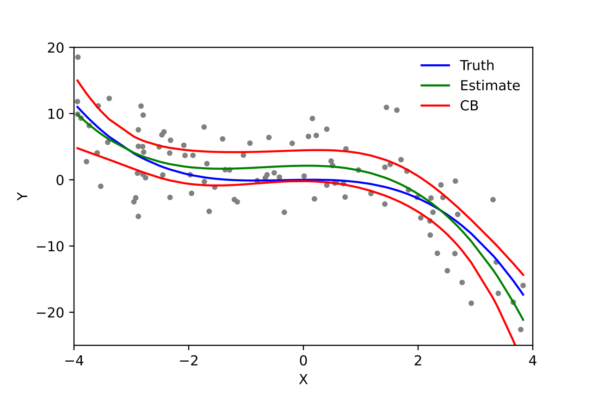

# Regression

## Definition

Regression is a Supervised Learning task used to predict a continuous numeric value (e.g., price, temperature, or age).

## Algorithms

### Linear Models

#### Linear Regression

- Regularization strength (Alpha/Lambda): Controls how much you penalize large coefficients to prevent overfitting.

- Fit Intercept: A boolean (True/False) determining whether to calculate the _b_ in: $y = mx + b$.

Multiple  regresion can include many variables:  $y = a + b_1x_1 + b_2x_2 + … + b_nx_n$.

#### Poisson Regression

- L1/L2 Regularization: Essential for stabilizing count predictions.

- Tolerance: The stopping criterion for the optimization algorithm.

### Tree-Based Regression

#### Decision Tree Regressor

- Max Depth: The most critical parameter. Limits how many "splits" the tree can make. Too deep = Overfitting.

- Min Samples Split: The minimum number of data points required to split an internal node.

#### Random Forest Regressor

- n_estimators: The number of trees in the forest. More trees increase stability but cost more compute.

- Max Features: The number of features to consider when looking for the best split.

#### Boosted Decision Tree (LightGBM)

- Learning Rate: How much each tree contributes to the final outcome. Usually between 0.01 and 0.3.

- Num Leaves: Controls the complexity of the tree. LightGBM is "leaf-wise," so this is more important than depth.

### 3. Specialized Regressors

#### Fast Forest Quantile Regression

- Quantiles: The specific percentiles you want to predict (e.g., 0.05, 0.5, 0.95).

#### Neural Network Regression

- Hidden Layer Architecture: Number of layers and nodes per layer.

- Learning Rate: How fast the weights are updated during training.

- Number of Iterations (Epochs): How many times the model sees the entire dataset.

## Regression Metrics

Regression is used when predicting a continuous numerical value (e.g., the price of a house or the temperature).

- **Mean Absolute Error (MAE)**: The average of the absolute differences between the predicted and actual values. It is easy to interpret as it is in the same units as the target.

- **Mean Squared Error (MSE)**: The average of the squared differences. This penalizes larger errors more heavily than smaller ones.

- **Root Mean Squared Error (RMSE)**: The square root of MSE. It brings the error metric back to the original units while still penalizing outliers.

- **R-Squared (R^2)**: Known as the "coefficient of determination." It represents the proportion of variance in the dependent variable that is predictable from the independent variables. An R^2 of 1.0 indicates a perfect fit.

## Comparison

| Algoritmo | Mejor usado para... | Complejidad del Modelo | Sensibilidad a Outliers | Característica Visual Clave |
| :--- | :--- | :--- | :--- | :--- |
| **Simple Linear Regression** | Relaciones directas y proporcionales entre dos variables. | Baja | Alta | Una línea recta que atraviesa una nube de puntos. |
| **Polynomial Regression** | Capturar relaciones curvas (ej. curvas de crecimiento). | Media | Alta | Una curva suave que puede tener múltiples dobleces. |
| **Support Vector Regression (SVR)** | Datasets complejos donde se busca ignorar el ruido menor. | Alta | Baja | Un "tubo" (épsilon-insensible) que encapsula los datos. |
| **Decision Tree Regression** | Capturar interacciones no lineales y cambios de "escalón". | Alta | Media | Una línea tipo "escalera" que sigue la tendencia de los datos. |
| **Random Forest Regression** | Predicciones de alto rendimiento en datasets grandes y complejos. | Muy Alta | Baja | Un conjunto de muchos árboles que suaviza los errores individuales. |
| **Ridge / Lasso Regression** | Prevenir el sobreajuste (overfitting) en modelos con muchas variables. | Media | Media | Similar a la lineal, pero la línea está "penalizada" para ser menos pronunciada. |