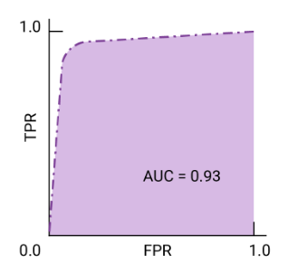

# Metrics

## 1. Classification Metrics
Classification is used when the target is a discrete category (e.g., "Spam" or "Not Spam"). 

### Confusion matrix

|Actual/Prediction|False|True|
|-|-|-|
|False|TN|FP (Error 1)|
|True|FN (Error 2)|TP|

### Metrics

- **Accuracy**: The ratio of correct predictions to total predictions. It is often misleading if the dataset is imbalanced (e.g., 99% of samples are "Healthy").

```Accuracy=TP/All```

- **Precision**: Out of all predicted positives, how many were actually positive? (Focuses on avoiding False Positives).

```Precision=TP/Predicted positives=TP/TP+Error 1```

- **Recall (Sensitivity)**: Out of all actual positives, how many did the model find? (Focuses on avoiding False Negatives).

```Recall=TP/Actual positives=TP/TP+Error 2```

- **F1-Score**: The harmonic mean of Precision and Recall. It provides a single score that balances both, especially useful for imbalanced data.

```F1=2(precision.recall/precision+recall)```

- **AUC-ROC**: Measures the model's ability to distinguish between classes at various threshold levels.




## 2. Regression Metrics
Regression is used when predicting a continuous numerical value (e.g., the price of a house or the temperature).

- **Mean Absolute Error (MAE)**: The average of the absolute differences between the predicted and actual values. It is easy to interpret as it is in the same units as the target.

- **Mean Squared Error (MSE)**: The average of the squared differences. This penalizes larger errors more heavily than smaller ones.

- **Root Mean Squared Error (RMSE)**: The square root of MSE. It brings the error metric back to the original units while still penalizing outliers.

- **R-Squared (R^2)**: Known as the "coefficient of determination." It represents the proportion of variance in the dependent variable that is predictable from the independent variables. An R^2 of 1.0 indicates a perfect fit.