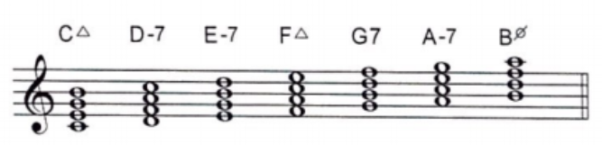

# Armonía

## Funciones tonales

La función tonal es la sensación que produce el acorde respecto al movimiento desde o hacia la tónica.

- __Tónica__: I y III `Reposo` *Sensación de reposo en la tónica*
- __Subdominante__: II, IV y VI `Movimiento` *Sensación de movimiento desde o hacia la tónica*
- __Dominante__: V y VII `Tensión` *Máxima tensión para ir hacia la tónica*

> Acordes de cuatriada en modo mayor

# Técnicas
## Transcripción armónica
Para transcribir los acordes de un tema se siguen estos pasos:
1. Determinar la estructura rítmica del tema. Ej. 3/4, 4/4
2. Determinar el ritmo armónico: cada cuánto cambian los acordes
3. Cantar la nota más grave de cada acorde (suele ser la tónica)
4. Buscar el nombre de la nota con un instrumento
5. Determinar la calidad de los acordes (mayor, menor)
6. Determinar la función de los acordes (tónica, subdominante, dominante)
